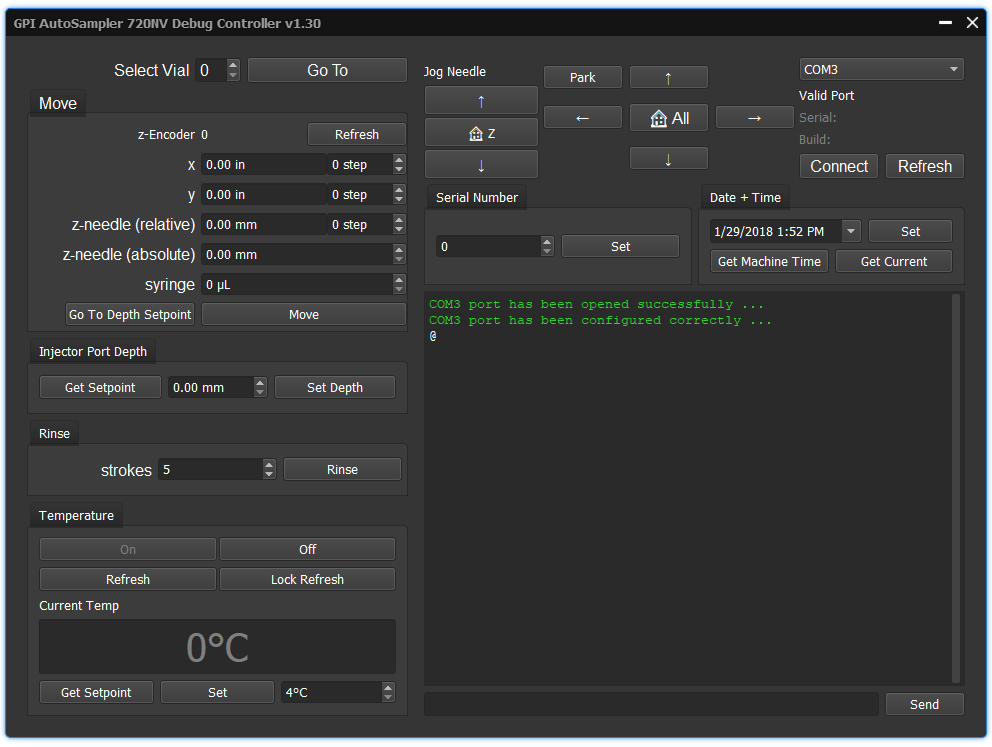

# GPInstruments 720NV Autosampler Debug Controller

This application is used to help speed up the calibration of Model 720NV Autosamplers. It allows to connect over RS-232 and control movement of the needle carraige, poll and set variables in memory, and monitor status of the machine. It supports sending arbitrary commands over serial as well but most commonly used functions are supported. Spend less time looking through the manual to find the one command you need and more time doing other things. Written in C++11 with Qt and  and available for Windows in 32 and 64bit flavors. 

### 